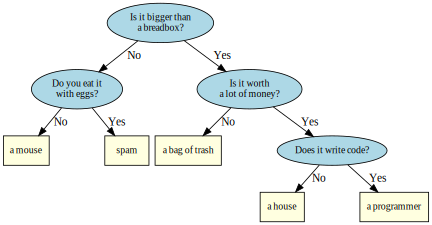

# Extra credit project: Twenty questions
The goal of this project is to create a game called **twenty questions**
that you play against the computer.

The object of the game is for the computer to guess what object
you are thinking of.

## Basic Gameplay
In the game 20 questions the player begins by thinking of an object.
The computers goal is to successfully guess what that object is.
The computer will ask the player a set of 20 questions (or less),
attempting to narrow down the list of possible results
until it finally thinks it knows the answer.
It will then present the result to the player.
If the computer successfully guesses the object it wins, otherwise it loses.

To get a feel for the spirit of the game we will implement,
you can play an online version of the 20 questions game
here: http://www.20q.net/.
Of course our game will be simpler in that the user will be restricted to only
yes or no questions and answers.

The 'knowledge' the computer stores about the world can be 
represented as a binary tree, 
as in the figure below. 
Each non-leaf node stores a question that helps the computer narrow down 
the space of possible answers,
while each leaf node stores the computer guess.



The game can be run either by loading an existing 20 questions tree 
from a text file,
or by starting with a default tree (described below). 

## Outline of play
Your program should be able to play at least 1 round of 20 questions.

1. If playing for the first time, the computer should ask:

   ```
   Is it bigger than a breadbox?
   ```

   If the user answers `No` play continues to the left side.  
   If the user answers `Yes` play continues to the right side.

2. Continue asking questions until the computer reaches a leaf node.
3. Display the leaf node value and ask the user if this guess is correct.

   a. If you answer `Yes`, then the computer wins.
      The computer should ask to play again.  
   b. If you answer `No`, then you win.
      The computer should ask:

      - What were you thinking of?  
      - A question that differentiates their object from the object
        just guessed by the computer.  
      - Whether the answer to the new question is `Yes` or `No`

   c. Use the new information to update the in memory tree
      and then ask the user if they want to play again.

4. Before exiting, ask the user if they want to save the game.  
   If yes, the program should write all the binary tree data to a file.  
   This file can be a plain text file.

## Turn in checklist
All projects will be graded according to the project rubric in Canvas.

Before uploading your project,
make sure it meets all of the rubric criteria in order to get full credit.

1. Ensure all project requirements are met and all results are correct.
2. Source code contains no global variables.
   Globals created as side effects of using library functions are OK (getopt, etc.).
3. Ensure the intent behind every program element is "crystal clear".
   Add documentation where it makes sense to do so.
4. Ensure the top of each source file includes your name and student ID.
5. The program must enforce the rules of the game.
   This includes handling error conditions.
6. Your finished project must compile on buffy.

## Project Requirements
In order to receive full credit, your project must satisfy **all**
of the following requirements:

1. Process command line arguments:   
   `-h` to display `h`elp text and exit.  
   `-f` to load a game tree from `f`ile.  
2. Gameplay is conducted as in the **Outline of play** section.
3.  While the program executes, it should be clear what is expected 
    from the player.
4. You must store all runtime game data in a binary tree data structure.  
   This `struct` must define pointers to the right and left child nodes,
   which are themselves of type binary tree.
5. All tree data should reside on the free store.
6. Use IO streams to read and write data from saved game files.
7. No memory leaks when analyzed using valgrind on the mesa server.
8. Program functions should be small and each function should perform
   exactly one task.
9. Project rubric requirements for correctness, clarity, design,
   and coding are met or exceeded.

## Details and hints about playing
As you play one round, 
your program walks down the tree, 
choosing to go to the 'yes' child or the 'no' child 
based on whether the user answers `Yes` or `No` to each question. 
You will need to determine a way to determine when your function 
should make a 'guess' rather than asking another question.

If the computer does not guess the answer, 
the program needs to augment the tree with a new question. 
Consider drawing several examples on paper to see how you'll handle modifying 
your tree before you start coding. 
Figure out what nodes you need to point to, 
and how their pointers will change based on the information the user 
provides before you start trying to code this.

It's fine if the computer saves text into the question tree exactly as the user enters it. 
For example, if the user enters "A MOUSE" it's OK to simply leave the text in all caps. 
However, you are also welcome to do any text processing you like to make the text 
stored in the game tree more standard. 
A couple ideas include:

- Standardizing capitalization
- Adding question marks to the end of questions

### Details about saving
In order to save and reload the game tree, you need to visit every tree node
**in the same order** every time.

If your program ever loses track of tree nodes, 
entire sections of the tree could seem to disappear.

Do not make this more complicated than necessary.
In order to correctly save all game state,
you only need to know if the tree node is a question or an answer.
For example:

```
Q:Is it bigger than a breadbox?
A:a mouse
A:a programmer
```

Is a perfectly adequate file format.

If your program works correctly, 
then all question nodes should have exactly 2 children.
All answer nodes should have exactly 0 children.

**You are not obligated to copy this format.**


## Example output

### Show help
```
./20q -h
Usage: ./20q [-h] [-f file_name]

Options:
  -h   Show this text.
  -f   Load a game tree from a file
```

### Play a default game
Play a game using the default question: 'Is it bigger than a breadbox?'

In these examples the computer's output is shown in black, 
while the user's responses are shown in green, with a leading `+`.

```diff
./20q
Is it bigger than a breadbox?
+ no
Is it spam?
+ no
OK, what was it?
+ a mouse
Give me a question that would distinguish a mouse from spam
+ Do you eat it with eggs?
And would the answer to the question for a mouse be yes or no?
+ no
Would you like to play again?
+ yes
Is it bigger than a breadbox?
+ yes
Is it a programmer?
+ no
OK, what was it?
+ a bag of trash
Give me a question that would distinguish a bag of trash from a programmer
+ Is it worth a lot of money?
And would the answer to the question for a bag of trash be yes or no?
+ no
Would you like to play again?
+ no
Would you like to save your game?
+ yes
Please enter a filename to save your game
+ data.txt
Game saved.
Goodbye!
```

### Play a game loaded from a file
Because the game can save and load questions,
it can improve the more it is played.

```diff
./20q -f data.txt
Is it bigger than a breadbox?
+ yes
Is it worth a lot of money?
+ yes
Is it a programmer?
+ no
OK, what was it?
+ a house
Give me a question that would distinguish a house from a programmer
+ Does it know C++?
And would the answer to the question for a house be yes or no?
+ no
Would you like to play again?
+ no
Would you like to save your game?
+ yes
Please enter a filename to save your game
+ tree2.txt
Game saved.
Goodbye!

```


